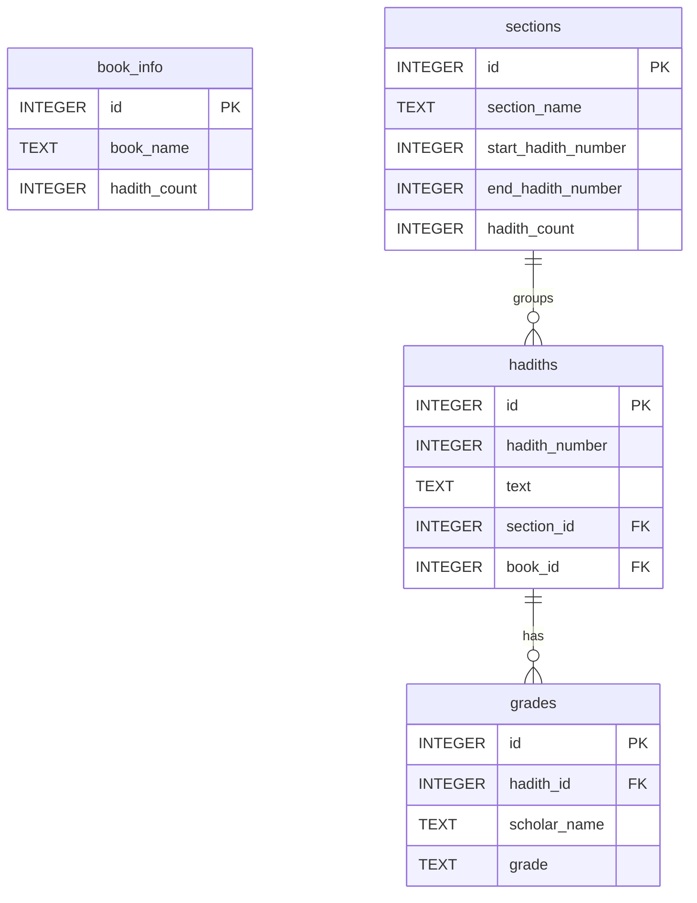

# Al-Hadith — High-Performance Offline Hadith Library

[](https://play.google.com/store/apps/details?id=com.ismail.al_hadith)
[](https://github.com/IsmailHosenIsmailJames/compressed_hadith_sqlite)
[](https://flutter.dev)

A modern, offline-first, and high-performance Islamic Hadith library application built using Flutter. The app allows users to download, search, browse, and study thousands of Hadith compilations across multiple languages entirely offline with zero latency, premium dark/light interfaces, and cloud-synced study progress.

---

## 📲 Get the App on Google Play Store

Download the official production build directly on your Android device:
👉 **[Play Store Link](https://play.google.com/store/apps/details?id=com.ismail.al_hadith)**

---

## 🚀 Core Mechanisms: How the App Works

This application is built on an **offline-first, zero-server-maintenance** architecture. It integrates dynamically with the [Compressed Hadith SQLite API](https://github.com/IsmailHosenIsmailJames/compressed_hadith_sqlite) to deliver compressed database datasets directly to the client.

### 1. Dynamic Asset Discovery & Extraction Pipeline
Instead of bundling massive databases in the initial app size, the client dynamically downloads and extracts resources on demand:
- **Discovery:** On first boot or via the Setup Wizard, the app queries `{baseUrl}/all_info.json` from the statically-hosted repository at `https://ismailhosenismailjames.github.io/compressed_hadith_sqlite`.
- **Selection:** The user chooses their preferred application language and selects specific Hadith editions (e.g., Sahih al-Bukhari, Sahih Muslim, Sunan Abu Dawud) they want to install.
- **Asynchronous Downloading:** The app downloads compressed `.sqlite.zip` files using the `Dio` network client, saving them directly to the app’s isolated documents sandbox (`hadith_databases`).
- **Background Decompression:** Using the `archive` package, the zip archives are uncompressed on-device.
- **Integrity Validation:** Before deleting the temporary ZIP and marking the book as downloaded in `SharedPreferences`, the `DatabaseHelper` runs a verification check querying the database to ensure the core tables (`book_info`, `sections`, `hadiths`, `grades`) exist and are healthy.

### 2. High-Performance Offline Database Engine
- **Read-Only SQLite Connections:** To optimize read operations and guarantee absolute file safety, the extracted `.sqlite` databases are accessed in **read-only mode** using the `sqflite` package.
- **Cache-Optimized Querying:** When browsing sections, the app avoids classic N+1 query loops. It executes a highly optimized two-query approach—fetching all section Hadiths in one query and retrieving all corresponding scholarly grades in a second unified batch query—combining them in-memory to ensure zero-lag scroll performance.
- **Offline Search:** Text query lookups are done instantly across millions of words utilizing standard relational index matching (`LIKE %query%`) locally.

### 3. Secure Cloud Backup & Smart Merging
- **Authentication:** Users can register and sign in securely utilizing Firebase Auth.
- **Cloud Backup:** Upon successful login, the `BackupService` securely uploads local metrics (bookmarks, pins, study notes, read progress indicators, last read sessions) to the Firebase Realtime Database under the authenticated user's UID (`users/$uid`).
- **Smart Merging Logic:** When logging in on a new device, the app fetches the remote cloud node and performs a smart, non-destructive merge:
  - Combines remote and local bookmarks/pins (taking a union of both lists).
  - Merges study notes, preserving local note content in case of timing conflicts.
  - Synchronizes reading progress lists dynamically.
  - Automatically updates the cloud backend with the newly merged state.

---

## 🗄️ SQLite Database Schema & Relations

The dynamically downloaded `.sqlite` files are built on a standardized schema that allows unified querying across all languages and editions:



### Table Details
- **`book_info`:** Contains global metadata for the specific edition, such as native book name and absolute Hadith counts.
- **`sections`:** Defines chapters/sections within a book along with starting/ending boundaries.
- **`hadiths`:** Holds the primary Arabic, English, Bengali, or other language translations.
- **`grades`:** Maps scholarly authenticities (such as *Sahih*, *Hasan*, *Da'if*) directly to Hadith rows, allowing instant validation.

---

## 📦 Codebase Directory Structure

The repository is organized following clean architecture patterns:

```text
lib/
├── main.dart                          # App initialization, service configurations
├── firebase_options.dart              # Platform-specific Firebase settings
└── core/                              # Shared app-wide features
    ├── constants/                     # API URLs and constant keys
    ├── database/                      # Isolated SQLite DatabaseHelper
    ├── localization/                  # Multilingual localization keys
    ├── router/                        # GoRouter navigation configurations
    └── theme/                         # Premium Material 3 color themes
└── data/                              # Data access layers
    ├── models/                        # JSON serialization data models
    ├── repositories/                  # Repositories (Hadith, Resource metadata)
    └── services/                      # Background services (Backup, Download, History)
└── logic/                             # State management (BLoC / Cubit)
    ├── auth/                          # Handles authentication status & merging
    ├── hadiths/                       # Handles active Hadith searches & readers
    ├── settings/                      # Configures settings (theme, languages)
    └── setup/                         # Wizard onboarding and resource downloads
└── presentation/                      # UI Components & Screen layouts
    ├── screens/                       # Screen routes (Home, Reader, Settings, Setup Wizard)
    └── widgets/                       # Modular UI components (Custom steps, lists)
```

---

## 🛠️ Compilation & Developer Guide

Follow these instructions to compile the project locally or build a production-ready package.

### 📋 Prerequisites
- **Flutter SDK:** Version `^3.11.5` installed and added to your environmental variables.
- **Android SDK:** Installed (via Android Studio) with Command-Line Tools for Android compilation.
- **Cocoapods / Xcode:** Required only if compiling the iOS target (on macOS).

### 🚀 Developer Setup

1. **Clone the repository:**
   ```bash
   git clone https://github.com/IsmailHosenIsmailJames/al_hadith.git
   cd al_hadith
   ```

2. **Retrieve package dependencies:**
   ```bash
   flutter pub get
   ```

3. **Configure Firebase:**
   This project uses standard FlutterFire CLI configurations. If you are deploying your own version:
   ```bash
   flutterfire configure
   ```

4. **Launch the development server:**
   Ensure an emulator is active or a device is connected:
   ```bash
   flutter run
   ```

### 📦 Compiling Release Builds

To build production-ready packages for deployment:

#### 1. Compile Release APK (Direct Device Installation)
```bash
flutter build apk --release
```
The output file will be generated at `build/app/outputs/flutter-apk/app-release.apk`.

#### 2. Compile Android App Bundle (Google Play Store Submission)
```bash
flutter build appbundle --release
```
The output file will be generated at `build/app/outputs/bundle/release/app-release.aab`.

#### 3. Compile iOS IPA (Apple App Store)
```bash
flutter build ipa --release
```

---

## 📄 License & Attributions

- The source code of this Flutter application is licensed under the **MIT License**.
- The underlying compressed SQLite datasets belong to their respective researchers, compilers, and the maintainer of the [Compressed Hadith SQLite API](https://github.com/IsmailHosenIsmailJames/compressed_hadith_sqlite).

*Built with ❤️ for the global Ummah.*
