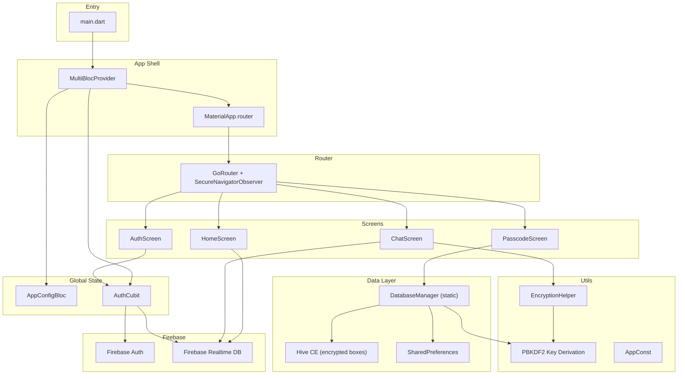
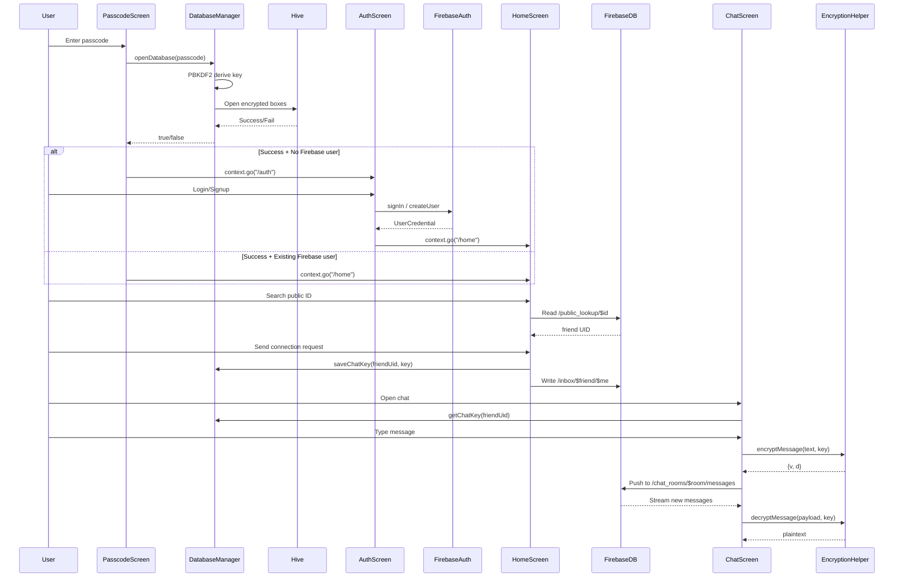

# Design Guide — Based on Simple Connect

> **Purpose**: This document captures every architectural decision, folder convention, dependency choice, state‑management pattern, routing strategy, data layer design, security policy, and UI convention used in the **Simple Connect** Flutter app. Follow this guide line‑by‑line when building any new app so all projects share a consistent, predictable structure.

---

## Table of Contents

1. [Technology Stack](#1-technology-stack)
2. [Project Structure](#2-project-structure)
3. [Entry Point & App Bootstrapping](#3-entry-point--app-bootstrapping)
4. [Routing](#4-routing)
5. [State Management (BLoC / Cubit)](#5-state-management-bloc--cubit)
6. [Data Layer](#6-data-layer)
7. [Cryptography & Security Utilities](#7-cryptography--security-utilities)
8. [Firebase Integration](#8-firebase-integration)
9. [UI Conventions](#9-ui-conventions)
10. [Constants & Configuration](#10-constants--configuration)
11. [Error Handling & User Feedback](#11-error-handling--user-feedback)
12. [Security Hardening](#12-security-hardening)
13. [Dependency Summary](#13-dependency-summary)
14. [Naming Conventions Cheatsheet](#14-naming-conventions-cheatsheet)
15. [Checklist for New Projects](#15-checklist-for-new-projects)

---

## 1. Technology Stack

| Layer | Choice | Notes |
|---|---|---|
| **Framework** | Flutter (Dart SDK `^3.11.5`) | Material Design (`uses-material-design: true`) |
| **State Management** | `flutter_bloc` + `bloc` (Cubit preferred) | BlocProvider at root; Cubit for simple cases |
| **Routing** | `go_router` | Declarative routes, `context.go()` / `context.push()` |
| **Local DB** | `hive_ce` + `hive_ce_flutter` | AES-256 encrypted boxes |
| **Remote DB** | Firebase Realtime Database (`firebase_database`) | Ephemeral data; burn-on-read model |
| **Auth** | Firebase Auth (`firebase_auth`) | Email/password; anonymous possible |
| **Crypto** | `cryptography` package | PBKDF2-SHA256, AES-256-GCM |
| **Screenshot Prevention** | `no_screenshot` | `SecureNavigatorObserver` on GoRouter |
| **On-screen Keyboard** | `flutter_onscreen_keyboard` | Wraps MaterialApp via `OnscreenKeyboard.builder()` |
| **Spacing** | `gap` | `Gap(n)` instead of `SizedBox(height: n)` |
| **Clipboard** | `clipboard` | `FlutterClipboard.copy()` |
| **Toasts** | `fluttertoast` | `Fluttertoast.showToast(msg: ...)` |
| **Prefs** | `shared_preferences` | Lockout timestamps, failure counters |

---

## 2. Project Structure

```
lib/
├── main.dart                          # Entry point
├── firebase_options.dart              # Auto-generated by FlutterFire CLI
└── src/
    ├── data/
    │   └── database_manager.dart      # Singleton DB class (static methods)
    ├── routes/
    │   └── routes.dart                # GoRouter configuration
    ├── screens/
    │   ├── app_open_passcode/
    │   │   └── app_open_passcode_screen.dart
    │   ├── auth/
    │   │   ├── auth_screen.dart
    │   │   └── controller/
    │   │       ├── auth_cubit.dart
    │   │       └── auth_state.dart
    │   ├── chat/
    │   │   └── chat_screen.dart
    │   ├── common/
    │   │   └── config/
    │   │       ├── config_bloc.dart
    │   │       └── config_model.dart
    │   └── home/
    │       └── home_screen.dart
    └── utils/
        ├── const.dart                 # App-wide string constants
        ├── encryption_helper.dart     # AES-256-GCM encrypt/decrypt
        └── passcode_to_32_byte_pbkdf2.dart
```

### Rules

| Rule | Convention |
|---|---|
| **Feature folders** | Each screen lives in `lib/src/screens/<feature_name>/` |
| **Controller co-location** | BLoC/Cubit files go in a `controller/` sub-folder next to the screen that owns them |
| **Shared state** | Cross-feature blocs live in `screens/common/` |
| **Utilities** | Pure helper functions (no Flutter dependency) go in `lib/src/utils/` |
| **Data layer** | Database managers / repositories go in `lib/src/data/` |
| **Routes** | A single `routes.dart` file in `lib/src/routes/` |
| **One screen per file** | Each `*_screen.dart` contains exactly one screen widget |

---

## 3. Entry Point & App Bootstrapping

```dart
void main() async {
  WidgetsFlutterBinding.ensureInitialized();
  await Firebase.initializeApp(options: DefaultFirebaseOptions.currentPlatform);
  await DatabaseManager.init();      // Open unencrypted config box
  runApp(const MyApp());
}
```

### Bootstrapping order

1. Ensure Flutter binding
2. Initialize Firebase
3. Open config-only (unencrypted) Hive box via `DatabaseManager.init()`
4. Run app

### MyApp widget pattern

```dart
class MyApp extends StatelessWidget {
  const MyApp({super.key});

  @override
  Widget build(BuildContext context) {
    return MultiBlocProvider(
      providers: [
        BlocProvider(create: (_) => AppConfigBloc()),
        BlocProvider(create: (_) => AuthCubit()),
        // ... add more global blocs here
      ],
      child: MaterialApp.router(
        title: 'App Name',
        builder: OnscreenKeyboard.builder(),   // keyboard overlay
        theme: ThemeData(
          colorScheme: ColorScheme.fromSeed(seedColor: Colors.green),
          inputDecorationTheme: InputDecorationTheme(
            border: OutlineInputBorder(),
          ),
        ),
        routerConfig: router,
      ),
    );
  }
}
```

### Key patterns

- Use `MaterialApp.router` (not `MaterialApp`) — routing is delegated to GoRouter.
- Global BLoC providers wrap the entire MaterialApp via `MultiBlocProvider`.
- `OnscreenKeyboard.builder()` is injected through `MaterialApp.builder`.
- Theme uses `ColorScheme.fromSeed()` for Material 3 color generation.
- `InputDecorationTheme` with `OutlineInputBorder()` is set globally so all text fields have a consistent outlined look.

---

## 4. Routing

### Configuration

```dart
final router = GoRouter(
  observers: [
    SecureNavigatorObserver(
      defaultConfig: SecureRouteConfig(mode: OverlayMode.secure),
    ),
  ],
  initialLocation: AppOpenPasscodeScreen.routePath,
  routes: [
    GoRoute(
      path: AppOpenPasscodeScreen.routePath,
      builder: (context, state) => AppOpenPasscodeScreen(),
    ),
    // ... more routes
  ],
);
```

### Rules

| Rule | Convention |
|---|---|
| **Route path constant** | Every screen exposes `static const String routePath = "/path"` |
| **Flat routes** | All routes are top-level GoRoute entries (no nested route trees) |
| **Parameter passing** | Dynamic segments via `:param` in path, extracted with `state.pathParameters['param']` |
| **Navigation** | `context.go(path)` for replace-navigation, `context.push(path)` for push-navigation |
| **Security observer** | `SecureNavigatorObserver` from `no_screenshot` is always attached |

### Screen route declaration pattern

```dart
class SomeScreen extends StatefulWidget {
  static const String routePath = "/some_screen";
  // ...
}
```

### Parameterized routes

```dart
// In routes.dart
GoRoute(
  path: "${ChatScreen.routePath}/:roomId/:friendUid",
  builder: (context, state) => ChatScreen(
    roomId: state.pathParameters['roomId']!,
    friendUid: state.pathParameters['friendUid']!,
  ),
),

// Navigation call
context.push('${ChatScreen.routePath}/$roomId/$friendUid');
```

---

## 5. State Management (BLoC / Cubit)

### When to use what

| Pattern | Use case |
|---|---|
| **Cubit** | Simple state with direct method calls (preferred default) |
| **Bloc (event-driven)** | Complex event streams, when you need event transformers/debounce |
| **StatefulWidget `setState`** | Purely local/ephemeral UI state (search loading, text controllers) |

### State class pattern

```dart
class AuthState {
  final bool loginUI;
  AuthState({required this.loginUI});

  AuthState copyWith({bool? loginUI}) {
    return AuthState(loginUI: loginUI ?? this.loginUI);
  }
}
```

- Immutable state classes
- `copyWith()` method for producing new state instances
- No `Equatable` — rely on reference equality (Cubit emits on every call)

### Cubit pattern

```dart
class AuthCubit extends Cubit<AuthState> {
  AuthCubit() : super(AuthState(loginUI: true));

  void changeLoginUI(bool isLoginUI) {
    emit(state.copyWith(loginUI: isLoginUI));
  }

  Future<bool> login({required String email, required String password}) async {
    // Firebase call, return success bool
  }
}
```

- Cubits return `Future<bool>` for async operations so the UI can react inline.
- No event classes needed — just public methods.

### Config Bloc (global settings Cubit)

```dart
class AppConfigBloc extends Cubit<AppConfigModel> {
  AppConfigBloc() : super(DatabaseManager.getAppConfig());

  void changeUserPhoneKeyboardState(bool isPhoneKeyBoard) {
    emit(state.copyWith(userPhoneKeyboard: isPhoneKeyBoard));
    DatabaseManager.saveAppConfig(state);  // persist immediately
  }
}
```

- Initial state is loaded synchronously from the already-opened Hive config box.
- State changes are persisted to Hive immediately after emit.

### BlocBuilder usage in screens

```dart
BlocBuilder<AppConfigBloc, AppConfigModel>(
  builder: (context, configState) {
    return BlocBuilder<AuthCubit, AuthState>(
      builder: (context, state) {
        if (state.loginUI) {
          return _loginForm(configState);
        } else {
          return _signupForm(configState);
        }
      },
    );
  },
)
```

- Nested `BlocBuilder` when a screen depends on multiple blocs.
- Access cubit methods via `context.read<MyCubit>().someMethod()`.

---

## 6. Data Layer

### DatabaseManager — Singleton with Static Methods

```dart
class DatabaseManager {
  static late Box _configBox;
  static late Box _userBox;
  static late Box _chatBox;

  static late bool checkIsPasscodeExits;

  static Future<void> init() async {
    await Hive.initFlutter();
    _configBox = await Hive.openBox(AppConst.congBoxName);
    checkIsPasscodeExits = await _configBox.get(
      AppConst.checkIsPasscodeExits,
      defaultValue: false,
    );
  }

  static Future<bool> openDatabase(String passcode) async { ... }
  static AppConfigModel getAppConfig() { ... }
  static Future<void> saveAppConfig(AppConfigModel data) { ... }
  static Future<void> saveChatKey(String friendUid, String key) { ... }
  static String? getChatKey(String friendUid) { ... }
}
```

### Rules

| Rule | Detail |
|---|---|
| **All static** | No instances — accessed as `DatabaseManager.method()` everywhere |
| **Two-phase init** | `init()` opens config (unencrypted). `openDatabase(passcode)` opens encrypted boxes |
| **Hive boxes** | `_configBox` (unencrypted), `_userBox` (encrypted), `_chatBox` (encrypted) |
| **Encryption** | PBKDF2-derived 256-bit key → `HiveAesCipher` |
| **Lockout logic** | Stored in `SharedPreferences` (not Hive) so it survives DB wipes |
| **Self-destruct** | After 10 failed attempts: `Hive.deleteFromDisk()` + `prefs.clear()` |

### Hive box naming via constants

```dart
class AppConst {
  static String congBoxName = "configs";
  static String userBox = "userBox";
  static String chatBox = "chatBox";
  static String checkIsPasscodeExits = "checkIsPasscodeExits";
  static String userPhoneKeyboard = "userPhoneKeyboard";
}
```

---

## 7. Cryptography & Security Utilities

### PBKDF2 Key Derivation (`passcode_to_32_byte_pbkdf2.dart`)

```dart
Future<List<int>> generateSecureKeyFromPassword(String password) async {
  final pbkdf2 = Pbkdf2(
    macAlgorithm: Hmac.sha256(),
    iterations: 100000,
    bits: 256,
  );
  final salt = utf8.encode('wHv=c&FsXszb*8dui@xy7#txKxYuFV0o'); // hardcoded salt
  final secretKey = await pbkdf2.deriveKeyFromPassword(
    password: password,
    nonce: salt,
  );
  return await secretKey.extractBytes();
}
```

- 100,000 iterations minimum
- SHA-256 HMAC
- Output: exactly 32 bytes (256 bits)
- Salt is currently hardcoded (should be random per-user in production)

### Encryption Helper (`encryption_helper.dart`)

```dart
class EncryptionHelper {
  static final _algorithm = AesGcm.with256bits();
  static final _hashAlgorithm = Sha256();

  static Future<String> getKeyHash(String base64Key) async { ... }
  static Future<Map<String, String>> encryptMessage(String text, String base64Key) async { ... }
  static Future<String> decryptMessage(String base64Payload, String base64Key) async { ... }
}
```

| Method | Returns |
|---|---|
| `getKeyHash()` | First 8 chars of Base64(SHA-256(key)) — used as key version tag `v` |
| `encryptMessage()` | `{'v': keyVersionHash, 'd': base64EncryptedPayload}` |
| `decryptMessage()` | Decrypted plaintext string |

### Rules

- Keys are always stored and transmitted as **Base64 URL-safe strings**.
- `SecretBox.fromConcatenation()` is used for combined nonce+ciphertext+mac format.
- Every encrypted message includes a version hash (`v`) so the receiver knows which key to use.

---

## 8. Firebase Integration

### Initialization

```dart
await Firebase.initializeApp(options: DefaultFirebaseOptions.currentPlatform);
```

- Uses `firebase_options.dart` generated by FlutterFire CLI.

### Authentication Pattern

```dart
// Signup
UserCredential cred = await FirebaseAuth.instance
    .createUserWithEmailAndPassword(email: email, password: password);

// Login
UserCredential cred = await FirebaseAuth.instance
    .signInWithEmailAndPassword(email: email, password: password);

// Current user check
if (FirebaseAuth.instance.currentUser != null) { ... }
```

### Realtime Database Patterns

#### Writing data

```dart
await FirebaseDatabase.instance
    .ref()
    .child('path')
    .child(id)
    .set({ 'key': 'value' });
```

#### Push (auto-ID)

```dart
final msgRef = FirebaseDatabase.instance
    .ref()
    .child('chat_rooms')
    .child(roomId)
    .child('messages')
    .push();
await msgRef.set({ ... });
```

#### Reading once

```dart
final snapshot = await FirebaseDatabase.instance
    .ref()
    .child('public_lookup')
    .child(searchId)
    .get();

if (snapshot.exists) {
  final uid = snapshot.value as String;
}
```

#### Streaming (real-time)

```dart
StreamBuilder<DatabaseEvent>(
  stream: FirebaseDatabase.instance
      .ref()
      .child('chat_rooms')
      .child(roomId)
      .child('messages')
      .orderByChild('t')
      .onValue,
  builder: (context, snapshot) {
    if (!snapshot.hasData || snapshot.data?.snapshot.value == null) {
      return Center(child: Text("No data."));
    }
    final value = snapshot.data!.snapshot.value;
    if (value is! Map) return Center(child: Text("No data."));
    final map = Map<String, dynamic>.from(value);
    // ... process
  },
)
```

#### Deleting

```dart
await FirebaseDatabase.instance
    .ref()
    .child('inbox')
    .child(myUid)
    .child(senderUid)
    .remove();
```

### Database Schema Convention

```
/public_lookup/$public_id         → "user_uid"
/users/$uid                       → { public_id, display_name }
/inbox/$receiver_uid/$sender_uid  → { status, timestamp }
/chat_rooms/$room_id/members      → { $uid: true }
/chat_rooms/$room_id/messages/$id → { s, t, v, d }
/user_chats/$uid/$room_id         → true
```

### Room ID generation

```dart
final users = [myUid, friendUid]..sort();
final roomId = "${users[0]}_${users[1]}";
```

- Deterministic: sorted UID pair joined by `_`.

---

## 9. UI Conventions

### Screen widget structure

```dart
class SomeScreen extends StatefulWidget {
  static const String routePath = "/some_path";
  const SomeScreen({super.key});

  @override
  State<SomeScreen> createState() => _SomeScreenState();
}

class _SomeScreenState extends State<SomeScreen> {
  // Controllers declared here
  final TextEditingController _controller = TextEditingController();
  final _formKey = GlobalKey<FormState>();

  @override
  Widget build(BuildContext context) {
    return Scaffold(
      appBar: AppBar(title: const Text("Title")),
      body: Padding(
        padding: const EdgeInsets.all(16.0),
        // ...
      ),
    );
  }
}
```

### Common UI patterns

| Pattern | Implementation |
|---|---|
| **Page padding** | `Padding(padding: EdgeInsets.all(16.0))` on Scaffold body |
| **Spacing** | `Gap(n)` between widgets (not `SizedBox`) |
| **Buttons** | `ElevatedButton.icon(icon:, iconAlignment: IconAlignment.end, label:)` |
| **Button sizing** | Wrapped in `ConstrainedBox(constraints: BoxConstraints(maxHeight: 60, maxWidth: 700, minWidth: 500, minHeight: 40))` |
| **Text fields** | `OnscreenKeyboardTextFormField` when secure keyboard is needed; plain `TextField` otherwise |
| **Form validation** | `Form` + `GlobalKey<FormState>` + `autovalidateMode: AutovalidateMode.onUserInteraction` |
| **Dialogs** | `showDialog()` with `AlertDialog(title:, content:, actions:)` |
| **Lists** | `ListView.builder` with `StreamBuilder` for real-time data |
| **Empty states** | `Center(child: Text("No data yet."))` |
| **Loading** | `CircularProgressIndicator()` |
| **Headings** | `TextStyle(fontSize: 26, fontWeight: FontWeight.w500)` for page titles |
| **Section titles** | `TextStyle(fontSize: 16, fontWeight: FontWeight.w600)` |
| **Avatars** | `CircleAvatar(radius: 30, backgroundColor:, child: Text(initials))` |

### Chat bubble pattern

```dart
Align(
  alignment: isMe ? Alignment.centerRight : Alignment.centerLeft,
  child: Container(
    margin: EdgeInsets.symmetric(vertical: 4, horizontal: 8),
    padding: EdgeInsets.all(12),
    decoration: BoxDecoration(
      color: isMe ? Colors.blue[100] : Colors.grey[300],
      borderRadius: BorderRadius.circular(12),
    ),
    child: Text(text),
  ),
),
```

### Input bar pattern (bottom of chat)

```dart
Padding(
  padding: EdgeInsets.all(8.0),
  child: Row(
    children: [
      Expanded(child: TextField(controller: _ctrl, decoration: ...)),
      IconButton(icon: Icon(Icons.send), onPressed: _send),
    ],
  ),
)
```

### Auth toggle pattern

```dart
Row(
  mainAxisAlignment: MainAxisAlignment.center,
  children: [
    Text("Don't have an account?"),
    TextButton(
      onPressed: () => context.read<AuthCubit>().changeLoginUI(false),
      child: Text("Signup"),
    ),
  ],
)
```

---

## 10. Constants & Configuration

### AppConst class

```dart
class AppConst {
  static String congBoxName = "configs";
  static String dbEncryptKey = "db_encrypt_key";
  static String userPhoneKeyboard = "userPhoneKeyboard";
  static String checkIsPasscodeExits = "checkIsPasscodeExits";
  static String userBox = "userBox";
  static String chatBox = "chatBox";
}
```

### Rules

- All Hive box names and key names are centralized here.
- Use `static String` (not `const`) — this is the current convention.
- No magic strings in screens or blocs — always reference `AppConst.xxx`.

---

## 11. Error Handling & User Feedback

| Scenario | Pattern |
|---|---|
| **Success** | `Fluttertoast.showToast(msg: "Successful")` |
| **Failure** | `Fluttertoast.showToast(msg: "Failed")` or descriptive message |
| **Validation** | Inline via `TextFormField.validator` + `autovalidateMode` |
| **Async errors** | `try/catch` wrapping Firebase calls; toast on catch |
| **Debug logging** | `dart:developer`'s `log()` function (not `print()`) |
| **Lockout** | Toast with remaining minutes |
| **Self-destruct** | Toast: `"10 failed attempts. Local data completely wiped."` |

---

## 12. Security Hardening

### Screenshot prevention

```dart
// In routes.dart
observers: [
  SecureNavigatorObserver(
    defaultConfig: SecureRouteConfig(mode: OverlayMode.secure),
  ),
],
```

- Applied globally to all routes via the GoRouter observer.

### On-screen keyboard

```dart
// In main.dart
builder: OnscreenKeyboard.builder(),

// In forms
OnscreenKeyboardTextFormField(
  controller: _controller,
  enableOnscreenKeyboard: configState.userPhoneKeyboard,
  // ...
)
```

- Controlled by `AppConfigBloc` (`userPhoneKeyboard` flag).

### Lockout & self-destruct

- Failed attempts counter in `SharedPreferences` (survives app kill).
- Exponential backoff: `pow(2, attempts - 1)` minutes.
- 10th failure: `Hive.deleteFromDisk()` + `prefs.clear()`.
- Lockout timestamp compared to `DateTime.now().millisecondsSinceEpoch`.

### RAM-only secrets

- Passcode and derived key are only held in variables during `openDatabase()`.
- No persistent storage of the passcode itself.

---

## 13. Dependency Summary

```yaml
dependencies:
  flutter:
    sdk: flutter
  cupertino_icons: ^1.0.8
  firebase_core: ^4.7.0
  firebase_database: ^12.3.0
  firebase_auth: ^6.4.0
  hive_ce: ^2.19.3
  hive_ce_flutter: ^2.3.4
  cryptography: ^2.9.0
  go_router: ^17.2.3
  bloc: ^9.2.0
  flutter_bloc: ^9.1.1
  no_screenshot: ^1.1.0
  flutter_onscreen_keyboard: ^0.4.6
  gap: ^3.0.1
  clipboard: ^3.0.14
  fluttertoast: ^9.0.0
  shared_preferences: ^2.2.3

dev_dependencies:
  flutter_test:
    sdk: flutter
  flutter_lints: ^6.0.0
```

> **Note**: Use `hive_ce` (Community Edition), NOT the original `hive` package.

---

## 14. Naming Conventions Cheatsheet

| Element | Convention | Example |
|---|---|---|
| **Screen file** | `snake_case_screen.dart` | `home_screen.dart` |
| **Screen class** | `PascalCase` + `Screen` suffix | `HomeScreen` |
| **Route path** | `static const String routePath` | `"/home"` |
| **Cubit file** | `feature_cubit.dart` | `auth_cubit.dart` |
| **State file** | `feature_state.dart` | `auth_state.dart` |
| **Cubit class** | `PascalCase` + `Cubit` suffix | `AuthCubit` |
| **Global Bloc** | `PascalCase` + `Bloc` suffix | `AppConfigBloc` |
| **Model file** | `feature_model.dart` | `config_model.dart` |
| **Model class** | `PascalCase` + `Model` suffix | `AppConfigModel` |
| **Constants class** | `AppConst` | `AppConst.userBox` |
| **Helper class** | `PascalCase` + `Helper` suffix | `EncryptionHelper` |
| **Manager class** | `PascalCase` + `Manager` suffix | `DatabaseManager` |
| **Private controller** | `_camelCase` + `Controller` | `_searchController` |
| **Private form key** | `_camelCase` + `FormKey` / `Key` | `_loginFormKey` |
| **Hive box names** | `camelCase` string | `"userBox"`, `"chatBox"` |
| **Firebase paths** | `snake_case` | `"public_lookup"`, `"chat_rooms"` |

---

## 15. Checklist for New Projects

Use this checklist every time you start a new project that should follow this design guide.

- [ ] **Create Flutter project** with `flutter create`
- [ ] **Set up folder structure**: `lib/src/{data, routes, screens, utils}`
- [ ] **Add all dependencies** from Section 13 to `pubspec.yaml`
- [ ] **Run FlutterFire CLI** to generate `firebase_options.dart`
- [ ] **Create `AppConst`** in `utils/const.dart` with box names and key names
- [ ] **Create `DatabaseManager`** in `data/` with `init()` and `openDatabase()`
- [ ] **Create state models** with `copyWith()` in `screens/common/config/`
- [ ] **Create `AppConfigBloc`** that reads initial state from `DatabaseManager`
- [ ] **Set up `routes.dart`** with `GoRouter`, `SecureNavigatorObserver`, and initial location
- [ ] **Set up `main.dart`** with `MultiBlocProvider` → `MaterialApp.router`
- [ ] **Create passcode screen** as the initial route
- [ ] **Create auth screen** with login/signup toggle via Cubit
- [ ] **Create home screen** with search, active items, and incoming requests
- [ ] **Create detail/chat screen** with parameterized route
- [ ] **Add encryption helpers** in `utils/`
- [ ] **Apply `OnscreenKeyboard.builder()`** in MaterialApp
- [ ] **Test lockout mechanism** (exponential backoff + self-destruct at 10)
- [ ] **Test screenshot prevention** on physical device
- [ ] **Verify encrypted Hive boxes** open/close correctly

---

## Architectural Diagram



---

## Data Flow Diagram



---

> **Follow this guide exactly** for every new app in the project family. When in doubt, check the source of truth: the `simple_connect` codebase.
